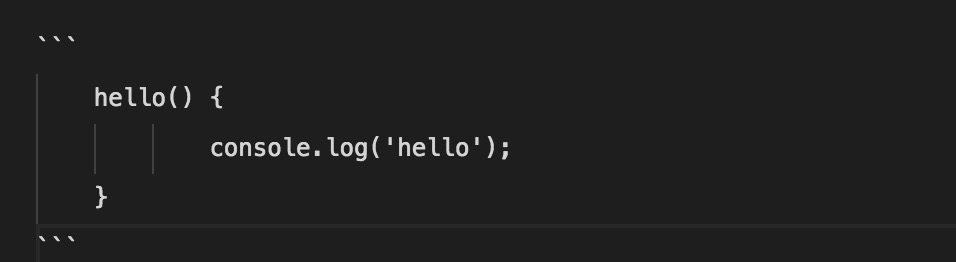

    Markdown是一种标记语言，文档后缀为 .md，.markdown

### 标题
    使用 # 号表示 1 - 6 级标题，一级标题对应一个 # 号，二级标题对应两个 # 号，以此类推。

> 示例：
```
# 一级标题
## 二级标题
### 三级标题
#### 四级标题
##### 五级标题
###### 六级标题
```
> - # 一级标题
> - ## 二级标题
> - ### 三级标题
> - #### 四级标题
> - ##### 五级标题
> - ###### 六级标题
---
### 字体
    字体修饰可分为斜体和粗体。
    用 * 号和 _ （短下划线）表示斜体或者粗体

> 示例：
```
*斜体*
_斜体_
**粗体**
__粗体__
***斜粗体***
__斜粗体__
```
> - *斜体*
> - _斜体_
> - **粗体**
> - __粗体__
> - ***斜粗体***
> - __斜粗体__
---

### 链接
    链接语法是一个中括号放显示的文本紧接着一个圆括号放真是地址，形如：[链接文本]（链接地址）

> 示例：

    [百度](http:www.baidu.com)一下，你就知道！

[百度](http:www.baidu.com)一下，你就知道！

---
### 图片
    markdown中引用一个图片的语法是：开头一个感叹号，接着一个方括号，里面是alt的属性值，接着一个圆括号，里面是图片的地址。形如：
    

> 示例：
```

```


---
### 分割线
    可以用三个及以上的星号、减号、下划线来创建一个分割线

> 示例：
```
***
---
___
```
> ***
> ---
> ___
---
### 删除线
    若需要在文字上添加删除线，可以在文字的两端添加两个波浪线 〰️

> 示例：
```
我是前面 ~~我是被删除的对象~~ 我是后面
```
> 我是前面 ~~我是被删除的对象~~ 我是后面
---
### 下划线
    下划线可以使用<u>标签来表示

> 示例：
```
<u>我有下划线<u>
```
> <u>我有下划线</u>
---
### 列表
    列表分为有序列表和无序列表，无序列表使用 * 、+ 、- 作为无序列表的标记.
    有序列表使用数字加上.号来表示。
    嵌套列表则在子列表的前面添加4个空格

    ⚠️ 符号和文本之间有空格

> 示例：
```
1. 无序列表
    - 列表1
    + 列表2
    * 列表3
2. 有序列表
    1. 有序列表1
    2. 有序列表2
```
1. 无序列表
    - 列表1
    + 列表2
    * 列表3
2. 有序列表
    1. 有序列表1
    2. 有序列表2

---
### 区块引用
    区块引用是在段落的开头使用 > 符号，后面紧接着一个空格符号

> 示例
```
> 名人名言
> 真的很有真理
> 提升文本的价值
```
> 名人名言
> 真的很有真理
> 提升文本的价值
---
### 代码区块
    代码段落可以使用反引号 ` 包裹，整个代码片段可以使用一个Tab（4个空格）或者 ``` 包裹。
> 例如
- 代码片段
```
`sayHello()`函数将会打印出hello
```
`sayHello()`函数将会打印出hello

- 制表符包裹代码片段
```
    hello() {
        console.log('hello');
    }
```

    hello() {
        console.log('hello');
    }

- ` ``` `包裹代码片段， 后面可以指定一种语言类型



```
    hello() {
            console.log('hello');
    }
```


